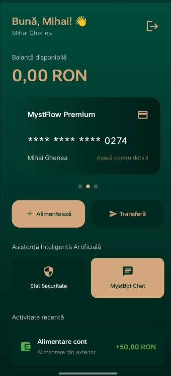

# MystFlow 💳✨

MystFlow is a modern, premium Android banking application built with **Kotlin** and **Jetpack Compose**. It features a stunning, dynamic user interface with 3D animations and is powered by a robust **Supabase** backend. It also integrates intelligent AI features to enhance user security and provide an interactive banking assistant.

## ✨ Features

* **📱 Modern UI & 3D Animations**: A beautifully crafted UI using Jetpack Compose, featuring a horizontal card carousel and an interactive 3D flip animation to securely reveal card details (CVV, Expiry Date).
* **💳 Multi-Card Support**: Users can generate and manage multiple independent virtual cards within the same account, each with its own balance and details.
* **💸 Seamless Transfers & Top-Ups**: Context-aware transactions allowing users to top up or transfer money from the specific card currently selected on the screen.
* **📜 Smart Transaction History**: Detailed activity logs that dynamically track and display the full names of senders and receivers, rather than generic transaction labels.
* **🤖 MystBot AI Integration**: A built-in AI assistant that proactively provides security insights and features an interactive chat to help users navigate their banking experience.
* **🔒 Secure Authentication**: Full user authentication and profile management securely handled via Supabase Auth.

## 🛠 Tech Stack

* **Language**: [Kotlin](https://kotlinlang.org/)
* **UI Framework**: [Jetpack Compose](https://developer.android.com/jetpack/compose)
* **Backend as a Service (BaaS)**: [Supabase](https://supabase.com/) (PostgreSQL, Auth, RPCs)
* **Asynchronous Programming**: Coroutines & Flows
* **Architecture**: MVVM (Model-View-ViewModel)

## 🚀 Getting Started

### Prerequisites
* Android Studio (latest stable version recommended)
* A [Supabase](https://supabase.com/) account and project.

### 1. Clone the repository
```bash
git clone https://github.com/Mihai-Tudor0/MystFlowTB.git
cd MystFlowTB
```

### 2. Configure Supabase
1. Navigate to your Supabase Dashboard.
2. Go to **SQL Editor** and open a new query.
3. Copy the contents of the `supabase_setup.sql` file located in the root of this repository and run it. 
   > **Note:** This script will create the necessary `profiles`, `cards`, and `transactions` tables, set up Row Level Security (RLS) policies, and create the required RPC functions (`top_up` and `perform_transfer`).
4. Retrieve your **Supabase URL** and **Anon Key** from the Supabase Dashboard (Project Settings -> API).
5. Add these credentials to your Android project (typically in a secure configuration file or `build.gradle` / `Constants.kt` depending on your current setup).

### 3. Build and Run
1. Open the project in Android Studio.
2. Sync the Gradle files.
3. Select your emulator or physical device.
4. Click **Run** (Shift + F10) to build and launch the app.

## 📱 Screenshots


## 🤝 Contributing
Project made by Ghenea Mihai-Tudor, Fratica Florian and Balan Eduard-Stefan.
