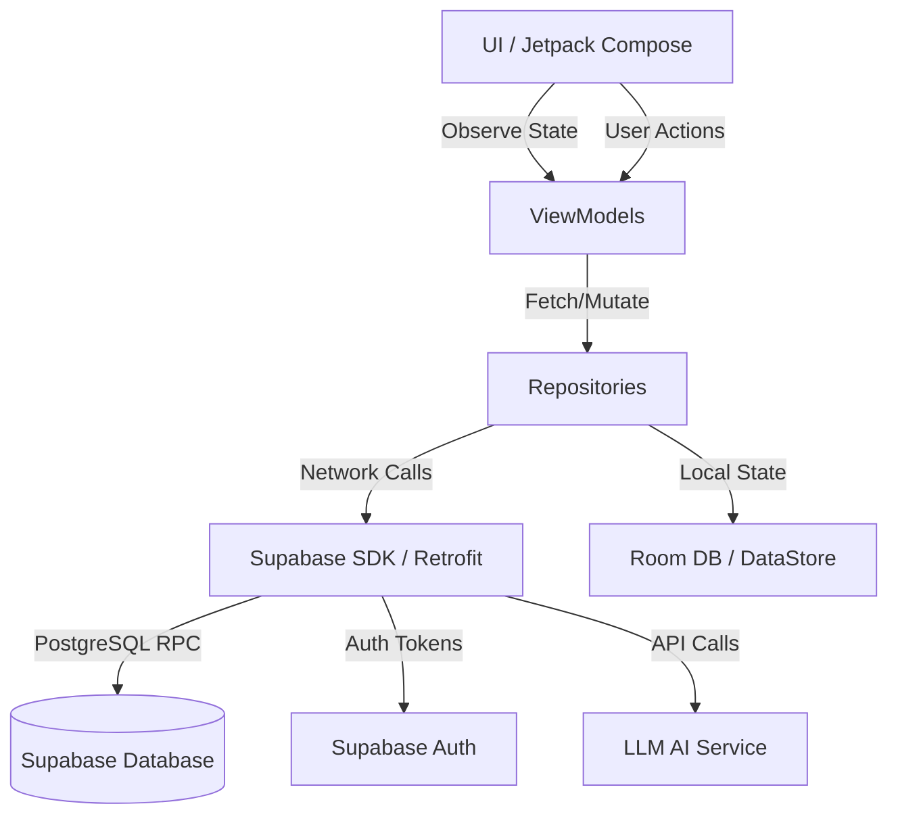
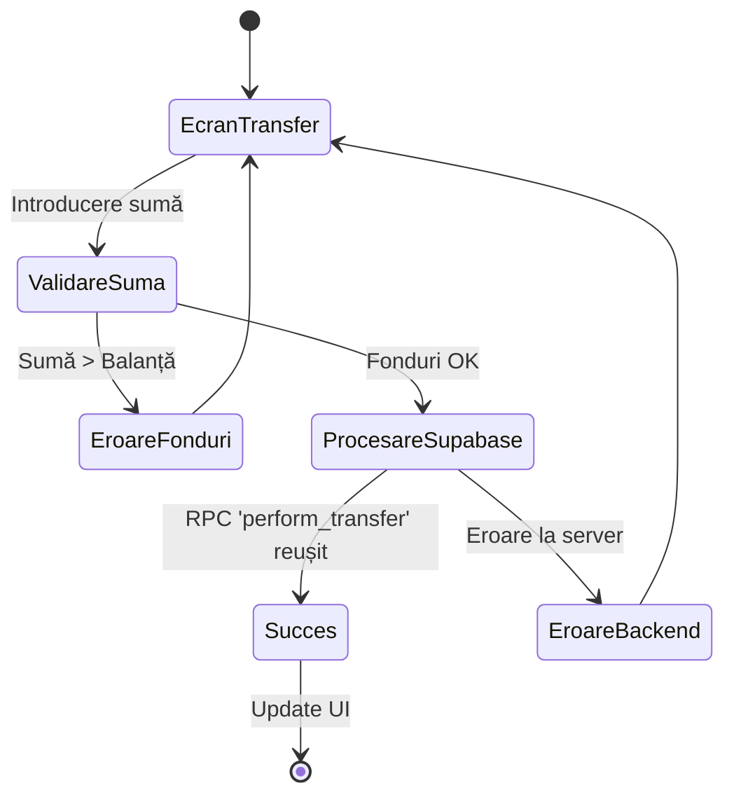
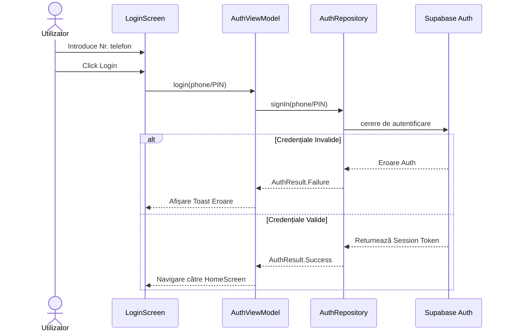

# Diagrame UML și Workflow-uri

Acest document prezintă vizual modul de funcționare și arhitectura aplicației **MystFlow**, folosind standardul Mermaid.js (randat direct de GitHub).

## 1. Arhitectura Componentelor (Component Diagram)
Aplicația folosește modelul MVVM (Model-View-ViewModel) împreună cu un backend BaaS (Supabase).

## 2. Diagrama de Stări: Tranzacție / Transfer (State Diagram)
Arată pașii prin care trece un utilizator când efectuează un transfer bancar.

## 3. Diagrama de Secvență: Autentificare (Sequence Diagram)
Descrie flow-ul de comunicare între client și server în timpul procesului de Login.

